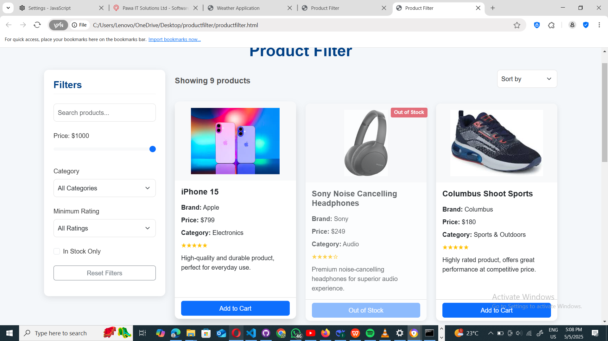

# Product Filter Application

[](https://developer.mozilla.org/en-US/docs/Web/HTML)
[](https://developer.mozilla.org/en-US/docs/Web/CSS)
[](https://developer.mozilla.org/en-US/docs/Web/JavaScript)
[](https://getbootstrap.com/)

A responsive product filtering application that allows users to browse and filter products by various criteria including price, category, rating, and availability.


.png)


## Features

- **Interactive Filtering**:
  - Price range slider with real-time updates
  - Category dropdown selector
  - Minimum rating filter
  - In-stock toggle
  - Search by product name, brand, or description

- **Sorting Options**:
  - Price (low to high / high to low)
  - Product rating
  - Alphabetical order

- **Responsive Design**:
  - Works on desktop, tablet, and mobile devices
  - Sticky filter sidebar on larger screens
  - Collapsible layout on smaller screens

- **User Experience**:
  - Real-time filtering as you adjust criteria
  - Product count display
  - "No results" message when filters return empty
  - Visual distinction for out-of-stock items
  - Reset all filters button

## Technologies Used

- **Frontend**:
  - HTML5
  - CSS3
  - JavaScript (ES6)
  - Bootstrap 5 (for responsive layout and components)

## Installation

1. **Clone the repository**:
   ```bash
   git clone https://github.com/333IAN/product-filter.git
   cd product-filter

2. Open in browser

### 3.Project Structure
```
product-filter/
├── productfilter.html        # Main HTML file
├── productfilter.css         # Custom styles
├── productfilter.js          # JavaScript functionality
├── Img/                      # Product images
│   ├── iphone15.jpg
│   ├── sonyHeadphones.jpg
│   ├── dellXPS13.jpg
│   └── ... (other product images)
└── README.md                 # This documentation
```
# Usage
1. Filter Products:
 -Adjust price slider to set maximum price
 -Select category from dropdown
 -Choose minimum rating
 -Toggle "In Stock Only" to hide unavailable items
 -Type in the searcgh box to find specific products
2. Sort Products:
 -Use the "Sort by" dropdown to change product ordering
3. Reset Filter:
 -Click the "Reset Filters" button to clear all filters

### Customization
To add your own products:
 1. Edit the products array in productfilter.js:
```
    const products = [
      {
        id: 1,
        name: "Product Name",
        price: 99.99,
        brand: "Brand Name",
        rating: 4,
        img: "Img/product-image.jpg",
        description: "Product description",
        category: "Category",
        available: true
    },
  
];
```

2.Add corresponding product images to the image/ directory

# Browser Support
The application is tested and works on:
```
  -Chrome(latest)
  -Firefox(latest)
  -Edge(latest)
  -Safari(latest)
  -Mobile browsers(Chrome, Safari)
```
# Contact
Contribution are welcome!
```
1. Fork the repository

2.Create a new branch (git checkout -b feature/your-feature)

3.Commit your changes (git commit -m 'Add some feature')

4.Push to the branch (git push origin feature/your-feature)

5.Open a Pull Request
```
Contact me <a href="https://github.com/333IAN">here</a>


